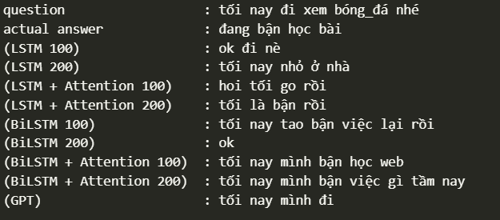

# Chatbot-for-Vietnamese
## Dataset
Tập dữ liệu gồm có 11522 dòng dữ liệu bao gồm 2 cột: question và answer, đây là bộ dữ liệu hỏi đáp giữa bạn bè với nhau, được tạo nên bởi các bạn sinh viên trường Đại học Tôn Đức Thắng.
## Code
Trong phần này, mình sử dụng các kiến trúc mô hình khác nhau cho bài toán Chatbot:  
- LSTM
- LSTM + Attention
- BiLSTM
- BiLSTM + Attention
- GPT
## Link pre-trained
https://drive.google.com/drive/folders/1RkumZHxrSDHxdkzl0jzOvc-RdLeoQZJW?usp=sharing
## Evaluation
- Biểu đồ Loss với 100 epochs

- Biểu đồ Loss cho tất cả các model

- Bảng đánh giá các model

- Demo

